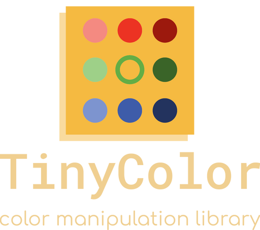

# TinyColor Unity


TinyColor Unity is a lightweight and efficient color manipulation and conversion library designed for use in Unity. This library is versatile, supporting various forms of input and providing essential color conversion functionalities and utility functions. Notably, it operates independently without any external dependencies.

TinyColor Unity is an adaptation of the JavaScript library [tinycolor2](https://github.com/bgrins/TinyColor) by [Brian Grinstead](https://github.com/bgrins). 
This port is tailored specifically for Unity users in the game development community. While retaining the core features of the original library, TinyColor Unity simplifies certain aspects, such as color parsing from strings and automatic detection of color formats. These adjustments aim to streamline the library for game development use cases, where such intricacies are typically less critical compared to web development scenarios.

## Demo
Feel free to explore the provided [demonstration](Samples~/Demonstration/Readme.md) for a more hands-on understanding of TinyColor Unity's capabilities.

## Install
 
* Open the add menu in the Package Manager's toolbar.
* The options for adding packages appear. Add package from git URL button.
* Select Add package from git URL from the add menu. A text box and an Add button appear.
* Enter https://github.com/cholushkin/TinyColor.git in the text box and click Add.


## Use

For comprehensive usage examples, refer to the following test files:
* [TinyColorConvertionsTest.cs](Tests/Runtime/TinyColorConvertionsTest.cs)
* [TinyColorModificationsTest.cs](Tests/Runtime/TinyColorModificationsTest.cs)

Here's an example of constructing a TinyColor object from the string "red" and converting it to a hex representation:

```csharp
string redHex = TinyColor.ParseFromName("red").ToHex6String(); // '#ff0000'
```

## Accepted String Input
You can parse color from string using on of the following methods:

* ParseFromName
* ParseFromHex
* ParseFromRGB
* ParseFromRGB256
* ParseFromHSL
* ParseFromHSV


Both HSL and HSV representations necessitate values within the range of 0.0f to 1.0f for the saturation (S), lightness (L), and value (V) properties. The hue (H) property, in the case of HSL, can range from 0f to 360f.

For RGB input, parsing can be done using either a range of 0 to 255 (ParseFromRGB) or 0.0f to 1.0f (ParseFromRGB256).

Below are examples demonstrating the parsing of string input:

### Hex

```csharp
TinyColor.ParseFromHex("#000");
TinyColor.ParseFromHex("#369C");
TinyColor.ParseFromHex("369C");
TinyColor.ParseFromHex("#f0f0f6");
TinyColor.ParseFromHex("f0f0f6");
TinyColor.ParseFromHex("#f0f0f688");
TinyColor.ParseFromHex("f0f0f688");
```

### RGB

```csharp
TinyColor.ParseFromRGB("1.0 1.0 1.0");
TinyColor.ParseFromRGB("1 0 0 0.5");
TinyColor.ParseFromRGB256("0 0 255 255");
TinyColor.ParseFromRGB("1 0 0");
```

### HSV, HSL

```csharp
TinyColor.ParseFromHSV("251.1 0.887 .918");
TinyColor.ParseFromHSL("251.1 0.887 .918");
```

### Named

```csharp
TinyColor.ParseFromName("RED");
TinyColor.ParseFromName("blanchedalmond");
TinyColor.ParseFromName("darkblue");
```


### Accepted Object Input

If you are calling this from code, you may want to use object input. Here are some examples of the different types of accepted object inputs:

```csharp
new TinyColor(0x0);
new TinyColor(0xaabbcc);
new TinyColor(new TinyColor.HSL(-700, 0.2f, 0.1f));
new TinyColor(new TinyColor.HSLA(100, 0.2f, 0.1f, 0.38f));
new TinyColor(new TinyColor.RGB(1, 1, 1));
```

## Methods

### GetBrightness

Returns the perceived brightness of a color, from 0-1, as defined by [Web Content Accessibility Guidelines (Version 1.0)](http://www.w3.org/TR/AERT#color-contrast).

```csharp
var color1 = TinyColor.ParseFromHex("#fff");
color1.GetBrightness(); // 1.0f

var color2 = TinyColor.ParseFromHex("#000");
color2.GetBrightness(); // 0.0f
```

### IsLight

Return a boolean indicating whether the color's perceived brightness is light.

```csharp
var color1 = TinyColor.ParseFromHex("#fff");
color1.IsLight(); // true

var color2 = TinyColor.ParseFromHex("#000");
color2.IsLight(); // false
```

### IsDark

Return a boolean indicating whether the color's perceived brightness is dark.

```csharp
var color1 = TinyColor.ParseFromHex("#fff");
color1.IsDark(); // false

var color2 = TinyColor.ParseFromHex("#000");
color2.IsDark(); // true
```

### GetLuminance

Returns the perceived luminance of a color, from 0-1 as defined by [Web Content Accessibility Guidelines (Version 2.0).](http://www.w3.org/TR/2008/REC-WCAG20-20081211/#contrast-ratiodef)

```csharp
var color1 = TinyColor.ParseFromHex("#fff");
color1.GetLuminance(); // 1f

var color2 = TinyColor.ParseFromHex("#000");
color2.GetLuminance(); // 0f
```

### GetAlpha

Returns the alpha value of a color, from 0-1.

```csharp
var color1 = TinyColor.ParseFromRGB256("255 0 0 255");
print(color1.A); // 1f

var color2 = TinyColor.ParseFromRGB256("255, 0, 0");
print(color2.A); // 1f
```

### SetAlpha

Sets the alpha value on a current color. Accepted range is in between 0-1.

```csharp
var color1 = TinyColor.ParseFromRGB256("255 0 0 255");
print(color1.A); // 1f
```

### OnBackground

Compute how the color would appear on a background. When the color is fully transparent (0.0f), the result will be the background color. When the color is not transparent at all (1.0f), the result will be the color itself. Otherwise you will get a computed result.

```csharp
var color1 = TinyColor.ParseFromRGB256("255 0 0 127").OnBackground(TinyColor.ParseFromRGB("0 0 255 255")); // RBG 127 0 128
var color1 = TinyColor.ParseFromRGB256("0 0 255 255").OnBackground(TinyColor.ParseFromRGB("0 0 0 127")); // RBG 0 0 255;
```

### Convert to different color formats

The methods listed below will yield an object that can be used directly or converted to a string.
* ToColor
* ToColor32
* ToRGBA256
* ToRGB256
* ToRGB
* ToRGBA
* ToHSL
* ToHSLA
* ToHSV
* ToHSVA
* ToNumber


```csharp
TinyColor color1 = TinyColor.ParseFromName("red");
var rgba = color1.ToRGBA().ToString(); // 1 0 0 1

TinyColor.ParseFromHSV("251.1 0.887 0.918 0.5").ToHSVA().ToString(); // "251.1 0.887 0.918 0.5"
```

### ToName

```csharp
TinyColor.ParseFromHex("#F00").ToName(); // "red"
```


### Color Modification

These methods manipulate the current color, and return it for chaining. For instance:

```csharp
TinyColor.ParseFromName("red")
  .Lighten()
  .Desaturate()
  .ToHex6String(); // #f53d3d
```

### Lighten

Lighten the color a given amount, from 0 to 1. Providing 1 will always return white.

```csharp
TinyColor.ParseFromHex("#f00").Lighten().ToHex6String(); // '#ff3333'
TinyColor.ParseFromHex("#f00").Lighten(1).ToHex6String(); // '#ffffff'
```

### Brighten

Brighten the color a given amount, from 0 to 1.

```csharp
TinyColor.ParseFromHex("#f00").Brighten().ToHex6String(); // '#ff1919'
```

### Darken

Darken the color a given amount, from 0 to 1. Providing 1 will always return black.

```csharp
TinyColor.ParseFromHex("#f00").Darken().ToHex6String(); // '#cc0000'
TinyColor.ParseFromHex("#f00").Darken(1).ToHex6String(); // '#000000'
```

### Tint

Mix the color with pure white, from 0 to 1. Providing 0 will do nothing, providing 1 will always return white.

```csharp
TinyColor.ParseFromHex("#f00").Tint().ToHex6String(); // '#ff1a1a'
TinyColor.ParseFromHex("#f00").Tint(1).ToHex6String(); // '#ffffff'
```

### Shade

Mix the color with pure black, from 0 to 1. Providing 0 will do nothing, providing 1 will always return black.

```csharp
TinyColor.ParseFromHex("#f00").Shade().ToHex6String(); // '#e60000'
TinyColor.ParseFromHex("#f00").Shade(1).ToHex6String(); // '#000000'
```

### Desaturate

Desaturate the color a given amount, from 0 to 1. Providing 1 will is the same as calling `greyscale`.

```csharp
TinyColor.ParseFromHex("#f00").Desaturate().ToHex6String(); // "#f20d0d"
TinyColor.ParseFromHex("#f00").Desaturate(1).ToHex6String(); // "#808080"
```

### Saturate

Saturate the color a given amount, from 0 to 1.

```csharp
TinyColor.ParseFromName("red").Saturate(0.2f);
```

### Greyscale

Completely desaturates a color into greyscale. Same as calling Desaturate(1).

```csharp
TinyColor.ParseFromHex('#f00').Greyscale().ToHex6String(); // "#808080"
```

### Spin

Spin the hue a given amount, from -360 to 360. Calling with 0, 360, or -360 will do nothing (since it sets the hue back to what it was before).

```csharp
TinyColor.ParseFromHex("#f00").Spin(180).ToHex6String(); // "#00ffff"
TinyColor.ParseFromHex("#f00").Spin(-90).ToHex6String(); // "#7f00ff"
TinyColor.ParseFromHex("#f00").Spin(90).ToHex6String(); // "#80ff00"

// spin(0) and spin(360) do nothing
TinyColor.ParseFromHex("#f00").Spin(0).ToHex6String(); // "#ff0000"
TinyColor.ParseFromHex("#f00").Spin(360).ToHex6String(); // "#ff0000"
```

### Mix

Mix the current color a given amount with another color, from 0 to 1. 0 means no mixing (return current color).

```csharp
var color1 = TinyColor.ParseFromHex("#f0f");
var color2 = TinyColor.ParseFromHex("#0f0");

color1.Mix(color2).ToHex6String(); // #808080
```

### Color Combinations

Combination functions return a list of TinyColor objects.

### Analogous

Generates a list of analogous colors based on the current color.

```csharp
var tRed = TinyColor.ParseFromName("red");
var combination = tRed.Analogous(); // "#FF0000", "#FF0066", "#FF0033", "#FF0000", "#FF3300", "#FF6600"
```

### Monochromatic

Generates a list of monochromatic colors based on the current color.


```csharp
var tRed = TinyColor.ParseFromName("red");
var combination = tRed.Monochromatic(); // "#FF0000", "#2A0000", "#550000", "#800000", "#AA0000", "#D40000"
```

### SplitComplement

Generates a list of complement colors.

```csharp
var tRed = TinyColor.ParseFromName("red");
var combination = tRed.SplitComplement(); // "#FF0000", "#CCFF00", "#0066FF"
```

### Triad

Alias for Polyad(3).

```csharp
var tRed = TinyColor.ParseFromName("red");
var combination = tRed.Triad(); // "#FF0000", "#00FF00", "#0000FF"
```

### Tetrad

Alias for Polyad(4).

```csharp
var tRed = TinyColor.ParseFromName("red");
var combination = tRed.Tetrad(); // "#FF0000", "#7FFF00", "#00FFFF", "#8000FF"
```

### Polyad

Get polyad colors.

```csharp
var colors = TinyColor.ParseFromName("red").Polyad(4); // "#FF0000", "#7FFF00", "#00FFFF", "#8000FF"
```

### Complement

Get complement color.

```csharp
var tRed = TinyColor.ParseFromName("red");
var color1 = tRed.Complement(); // 00FFFF
```

### Readability

TinyColor assesses readability based on the [Web Content Accessibility Guidelines (Version 2.0)](http://www.w3.org/TR/2008/REC-WCAG20-20081211/#contrast-ratiodef).

#### Readability
Returns the contrast ratio between two colors.

```csharp
ReadabilityHelpers.Readability(TinyColor.ParseFromHex("#000"), TinyColor.ParseFromHex("#000")); // 1
ReadabilityHelpers.Readability(TinyColor.ParseFromHex("#000"), TinyColor.ParseFromHex("#111")); // 1.1121078324840545
```

Use the values in your own calculations, or use one of the convenience functions below.

#### IsReadable

Ensure that foreground and background color combinations meet WCAG guidelines. 
Here are links to read more about the [AA](http://www.w3.org/TR/UNDERSTANDING-WCAG20/visual-audio-contrast-contrast.html) and [AAA](http://www.w3.org/TR/UNDERSTANDING-WCAG20/visual-audio-contrast7.html) requirements.

```csharp
// "#ff0088", "#5c1a72": contrast ratio 3.04
ReadabilityHelpers.IsReadable(TinyColor.ParseFromHex("#ff0088"), TinyColor.ParseFromHex("#5c1a72"), ReadabilityHelpers.WCAGLevel.AA, ReadabilityHelpers.WCAGSize.Small); // false
ReadabilityHelpers.IsReadable(TinyColor.ParseFromHex("#ff0088"), TinyColor.ParseFromHex("#5c1a72"), ReadabilityHelpers.WCAGLevel.AA, ReadabilityHelpers.WCAGSize.Large); // true
```

#### MostReadable

Given a base color and a list of possible foreground or background colors for that base, returns the most readable color.
If none of the colors in the list is readable, MostReadable will return the better of black or white if IncludeFallbackColors == true. 

```csharp
ReadabilityHelpers.MostReadable( TinyColor.ParseFromHex("#000"),
  new List<TinyColor> { TinyColor.ParseFromHex("#111"), TinyColor.ParseFromHex("#222") })
  .ToHex6String(); // "#222222"
```


## Common operations

### Clone

Instantiate a new TinyColor object with the same color. Any changes to the new one won't affect the old one.

```csharp
TinyColor color1 = TinyColor.ParseFromName("red"); // Instantiate the initial color
TinyColor color2 = TinyColor.ParseFromName("red").Clone() as TinyColor; // Clone the color
```
