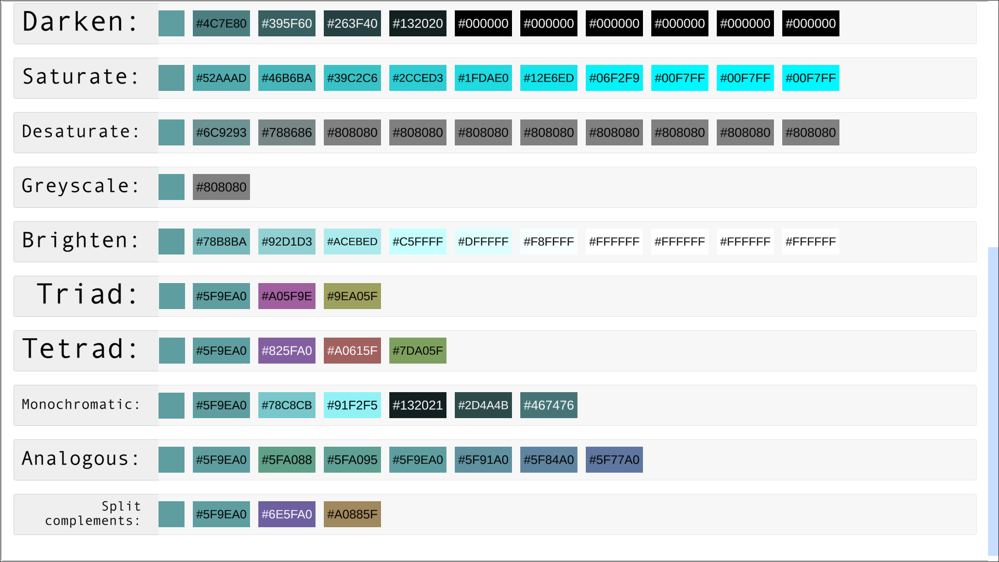

# TinyColor demonstration
To explore the TinyColor capabilities, you can easily import the Demonstration sample using the Unity Package Manager.

To import package samples, use the Unity Package Manager window:
* Go to Window > Package Manager and, in the packages list view, select TinyColor.
* In the package details view, find the Samples section.
* Find the sample you want to import and click the Import button next to it.

This example provides the option to either select a color from the list or manually input the hex value of the color. Subsequently, you can observe various modifications applied to the selected color:

Ensure to scroll the window to view the entirety of the example:

Additionally, you can click on any color rectangle within the window. This action will set the clicked color as the new current color and refresh the entire view for a seamless exploration experience.
